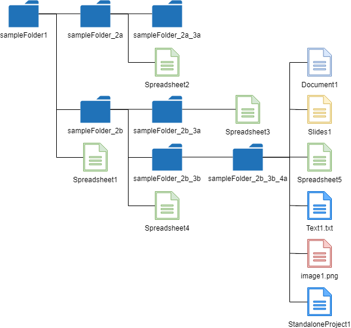

# GetFileList_js

[](https://travis-ci.org/tanaikech/GetFileList_js)
[](LICENCE)

<a name="top"></a>

# Overview

This is a Javascript library to retrieve the file list with the folder tree from the specific folder (publicly shared folders and own folders) of own Google Drive and shared Drives.

# Description

The library for retrieving the file list with the folder tree from the specific folder of Google Drive has already been published for Google Apps Script, golang, node.js and python as GetFileList. [Ref](https://gist.github.com/tanaikech/4fca197b8ec45c8ac6300b1531c2489d) Here, this GetFileList was released as the library of Javascript.

## Sample situations

1. Retrieve the file list in the shared folder and own folder using the API and the access token with gapi.

2. When an application of the side bar and dialog of Google Docs is created, there is the case that the file list is required to be retrieved. Of course, this can be done using Google Apps Script. But, the side bar and dialog can use Javascript. And this means that v8 engine can be used. If the file list can be retrieved by Javascript, the process cost will become lower than that of the method for using Google Apps Script. This library can be also used such situation.

## Features

- This module retrieves all files from a folder in Google Drive.
- All files include the folder structure in Google Drive.
- Only folder tree can be also retrieved.

# Install

```html
<script src="getfilelist_js.min.js"></script>
```

Or, using jsdelivr cdn

```html
<script src="https://cdn.jsdelivr.net/gh/tanaikech/GetFileList_js@master/getfilelist_js.min.js"></script>
```

<a name="method"></a>

# Method

| Method                | Explanation                                            |
| :-------------------- | :----------------------------------------------------- |
| GetFolderTree(object) | Retrieve only folder structure from a folder           |
| GetFileList(object)   | Retrieve file list with folder structure from a folder |

<a name="usage"></a>

# Usage

There are 3 patterns for using this library.

<a name="useapi"></a>

## 1. Use API key

This is a sample script using API key. When you want to retrieve the API key, please do the following flow.

1. Login to Google.
2. Access to [https://console.cloud.google.com/?hl=en](https://console.cloud.google.com/?hl=en).
3. Click select project at the right side of "Google Cloud Platform" of upper left of window.
4. Click "NEW PROJECT"
   1. Input "Project Name".
   2. Click "CREATE".
   3. Open the created project.
   4. Click "Enable APIs and get credentials like keys".
   5. Click "Library" at left side.
   6. Input "Drive API" in "Search for APIs & Services".
   7. Click "Google Drive API".
   8. Click "ENABLE".
   9. Back to [https://console.cloud.google.com/?hl=en](https://console.cloud.google.com/?hl=en).
   10. Click "Enable APIs and get credentials like keys".
   11. Click "Credentials" at left side.
   12. Click "Create credentials" and select API key.
   13. Copy the API key. You can use this API key.

### Sample script

When the API key is used, the values can be retrieved from only the publicly shared folder. Please be careful this. If you want to retrieve the folder which is not shared in your Google Drive, [please use the access token](#useaccesstoken).

```html
<script src="getfilelist_js.min.js"></script>

<script>
  const folderId = "###"; // In this case, this is the folder ID of the publicly shared folder.

  const resource = {
    apiKey: "###",
    id: folderId,
    fields: "files(id,name)",
  };
  const fl = new GetFileList();
  fl.getFileList(resource)
    // or fl.getFolderTree(resource)
    .then((res) => {
      console.log(res);
    })
    .catch((err) => {
      console.log(err);
    });
</script>
```

### Note

- **When you want to retrieve the file list from the folder using API key, the folder is required to be shared.**
- You can modify the property of `fields`. When this is not used, the default fields are used.

<a name="useaccesstoken"></a>

## 2. Use Access token

Document of OAuth2 is [here](https://developers.google.com/identity/protocols/OAuth2).

### Sample script 1

In this sample script, it supposes that the access token is retrieved by [Google APIs Client Library for browser JavaScript, aka gapi](https://github.com/google/google-api-javascript-client).

```html
<script src="getfilelist_js.min.js"></script>

<script>
  const folderId = "###"; // In this case, this is the folder ID of the publicly shared folder.

  const resource = {
    accessToken: gapi.auth.getToken().access_token,
    id: folderId,
    fields: "files(id,name)",
  };
  const fl = new GetFileList();
  fl.getFileList(resource)
    // or fl.getFolderTree(resource)
    .then((res) => {
      console.log(res);
    })
    .catch((err) => {
      console.log(err);
    });
</script>
```

### Sample script 2

In this sample script, it supposes that the access token is retrieved by [
HTML Service of Google Apps Script](https://developers.google.com/apps-script/reference/html/). Such situation can be used for [the dialog and side bar of Google Docs](https://developers.google.com/apps-script/guides/dialogs).

#### HTML side: index.html

```html
<script src="https://cdn.jsdelivr.net/gh/tanaikech/GetFileList_js@master/getfilelist_js.min.js"></script>

<input type="button" value="Run script" onClick="run()" />

<script>
  function run() {
    google.script.run
      .withSuccessHandler((accessToken) => runGetFileList(accessToken))
      .getAuth();
  }

  function runGetFileList(accessToken) {
    const folderId = "###"; // In this case, this is the folder ID of the publicly shared folder.

    const resource = {
      accessToken: accessToken,
      id: folderId,
      fields: "files(id,name)",
    };
    const fl = new GetFileList();
    fl.getFileList(resource)
      // or fl.getFolderTree(resource)
      .then((res) => {
        console.log(res);
      })
      .catch((err) => {
        console.log(err);
      });
  }
</script>
```

#### GAS side: Code.gs

```javascript
function getAuth() {
  return ScriptApp.getOAuthToken();
}

function doGet() {
  return HtmlService.createHtmlOutputFromFile("index");
}

// DriveApp.getFiles(); // This is used for the scope.
```

- If you want to include the script of library at Google Apps Script project, you can also load the library using `<?!= include('getfilelist'); ?>`.

### Note

- You can modify the property of `fields`. When this is not used, the default fields are used.

# Values



As a sample, when the values are retrieved from above structure, the results of `GetFolderTree()` becomes as follows.

## Values retrieved by GetFolderTree()

```javascript
const fl = new GetFileList();
fl.getFolderTree(resource)
  .then((res) => {
    console.log(res);
  })
  .catch((err) => {
    console.log(err);
  });
```

```json
{
  "id": [
    ["folderIdOfsampleFolder1"],
    ["folderIdOfsampleFolder1", "folderIdOfsampleFolder_2a"],
    ["folderIdOfsampleFolder1", "folderIdOfsampleFolder_2b"],
    [
      "folderIdOfsampleFolder1",
      "folderIdOfsampleFolder_2a",
      "folderIdOfsampleFolder_2a_3a"
    ],
    [
      "folderIdOfsampleFolder1",
      "folderIdOfsampleFolder_2b",
      "folderIdOfsampleFolder_2b_3a"
    ],
    [
      "folderIdOfsampleFolder1",
      "folderIdOfsampleFolder_2b",
      "folderIdOfsampleFolder_2b_3b"
    ],
    [
      "folderIdOfsampleFolder1",
      "folderIdOfsampleFolder_2b",
      "folderIdOfsampleFolder_2b_3b",
      "folderIdOfsampleFolder_2b_3b_4a"
    ]
  ],
  "names": [
    "sampleFolder1",
    "sampleFolder_2a",
    "sampleFolder_2b",
    "sampleFolder_2a_3a",
    "sampleFolder_2b_3a",
    "sampleFolder_2b_3b",
    "sampleFolder_2b_3b_4a"
  ],
  "folders": [
    "folderIdOfsampleFolder1",
    "folderIdOfsampleFolder_2a",
    "folderIdOfsampleFolder_2b",
    "folderIdOfsampleFolder_2a_3a",
    "folderIdOfsampleFolder_2b_3a",
    "folderIdOfsampleFolder_2b_3b",
    "folderIdOfsampleFolder_2b_3b_4a"
  ]
}
```

## Values retrieved by Do()

```javascript
const fl = new GetFileList();
fl.getFileList(resource)
  .then((res) => {
    console.log(res);
  })
  .catch((err) => {
    console.log(err);
  });
```

```json
{
  "searchedFolder": {
    "id": "###",
    "name": "sampleFolder1",
    "mimeType": "application/vnd.google-apps.folder",
    "parents": ["###"],
    "createdTime": "2000-01-01T01:23:45.000Z",
    "modifiedTime": "2000-01-01T01:23:45.000Z",
    "webViewLink": "https://drive.google.com/drive/folders/###",
    "owners": [
      { "displayName": "###", "permissionId": "###", "emailAddress": "###" }
    ],
    "shared": true
  },
  "folderTree": {
    "id": [
      ["folderIdOfsampleFolder1"],
      ["folderIdOfsampleFolder1", "folderIdOfsampleFolder_2a"],
      ["folderIdOfsampleFolder1", "folderIdOfsampleFolder_2b"],
      [
        "folderIdOfsampleFolder1",
        "folderIdOfsampleFolder_2a",
        "folderIdOfsampleFolder_2a_3a"
      ],
      [
        "folderIdOfsampleFolder1",
        "folderIdOfsampleFolder_2b",
        "folderIdOfsampleFolder_2b_3a"
      ],
      [
        "folderIdOfsampleFolder1",
        "folderIdOfsampleFolder_2b",
        "folderIdOfsampleFolder_2b_3b"
      ],
      [
        "folderIdOfsampleFolder1",
        "folderIdOfsampleFolder_2b",
        "folderIdOfsampleFolder_2b_3b",
        "folderIdOfsampleFolder_2b_3b_4a"
      ]
    ],
    "names": [
      "sampleFolder1",
      "sampleFolder_2a",
      "sampleFolder_2b",
      "sampleFolder_2a_3a",
      "sampleFolder_2b_3a",
      "sampleFolder_2b_3b",
      "sampleFolder_2b_3b_4a"
    ],
    "folders": [
      "folderIdOfsampleFolder1",
      "folderIdOfsampleFolder_2a",
      "folderIdOfsampleFolder_2b",
      "folderIdOfsampleFolder_2a_3a",
      "folderIdOfsampleFolder_2b_3a",
      "folderIdOfsampleFolder_2b_3b",
      "folderIdOfsampleFolder_2b_3b_4a"
    ]
  },
  "fileList": [
    {
      "folderTree": ["folderIdOfsampleFolder1"],
      "files": [
        {
          "name": "Spreadsheet1",
          "mimeType": "application/vnd.google-apps.spreadsheet"
        }
      ]
    },
    {
      "folderTree": ["folderIdOfsampleFolder1", "folderIdOfsampleFolder_2a"],
      "files": [
        {
          "name": "Spreadsheet2",
          "mimeType": "application/vnd.google-apps.spreadsheet"
        }
      ]
    },
    {
      "folderTree": ["folderIdOfsampleFolder1", "folderIdOfsampleFolder_2b"],
      "files": [
        {
          "name": "Spreadsheet4",
          "mimeType": "application/vnd.google-apps.spreadsheet"
        }
      ]
    },
    {
      "folderTree": [
        "folderIdOfsampleFolder1",
        "folderIdOfsampleFolder_2a",
        "folderIdOfsampleFolder_2a_3a"
      ],
      "files": null
    },
    {
      "folderTree": [
        "folderIdOfsampleFolder1",
        "folderIdOfsampleFolder_2b",
        "folderIdOfsampleFolder_2b_3a"
      ],
      "files": [
        {
          "name": "Spreadsheet3",
          "mimeType": "application/vnd.google-apps.spreadsheet"
        }
      ]
    },
    {
      "folderTree": [
        "folderIdOfsampleFolder1",
        "folderIdOfsampleFolder_2b",
        "folderIdOfsampleFolder_2b_3b"
      ],
      "files": null
    },
    {
      "folderTree": [
        "folderIdOfsampleFolder1",
        "folderIdOfsampleFolder_2b",
        "folderIdOfsampleFolder_2b_3b",
        "folderIdOfsampleFolder_2b_3b_4a"
      ],
      "files": [
        {
          "name": "Document1",
          "mimeType": "application/vnd.google-apps.document"
        },
        {
          "name": "image1.png",
          "mimeType": "image/png"
        },
        {
          "name": "Slides1",
          "mimeType": "application/vnd.google-apps.presentation"
        },
        {
          "name": "Spreadsheet5",
          "mimeType": "application/vnd.google-apps.spreadsheet"
        },
        {
          "name": "StandaloneProject1",
          "mimeType": "application/vnd.google-apps.script"
        },
        {
          "name": "Test1.txt",
          "mimeType": "text/plain"
        }
      ]
    }
  ],
  "totalNumberOfFiles": 10,
  "totalNumberOfFolders": 7
}
```

# Important

At Google Drive, the files and folders are managed by IDs. For example, one file and one folder can have multiple parent folders. But in this library, the 1st parent folder is retrieved. I thought that at the most cases, one file and folder will have one parent folder. So I used this. If in your environment, one file and folder has multiple parent folder, only 1st parent folder is retrieved. And also, the files and folders which have no parent folders cannot be retrieved. Please be careful this.

# For other languages

As the libraries "GetFileList" for other languages, there are following libraries.

- Golang: [https://github.com/tanaikech/go-getfilelist](https://github.com/tanaikech/go-getfilelist)
- Google Apps Script: [https://github.com/tanaikech/FilesApp](https://github.com/tanaikech/FilesApp)
- Javascript: [https://github.com/tanaikech/GetFileList_js](https://github.com/tanaikech/GetFileList_js)
- Node.js: [https://github.com/tanaikech/node-getfilelist](https://github.com/tanaikech/node-getfilelist)
- Python: [https://github.com/tanaikech/getfilelistpy](https://github.com/tanaikech/getfilelistpy)

---

<a name="licence"></a>

# Licence

[MIT](LICENCE)

<a name="author"></a>

# Author

[Tanaike](https://tanaikech.github.io/about/)

If you have any questions and commissions for me, feel free to tell me.

<a name="updatehistory"></a>

# Update History

- v1.0.0 (September 12, 2019)

  1. Initial release.

- v1.0.1 (September 30, 2019)

  1. A bug related to the scope of variables was removed.

- v1.0.2 (May 15, 2020)

  1. Shared drive got to be able to be used. The file list can be retrieved from both your Google Drive and the shared drive.

     - For example, when the folder ID in the shared Drive is used `id` of `resource`, you can retrieve the file list from the folder in the shared Drive.

[TOP](#top)
